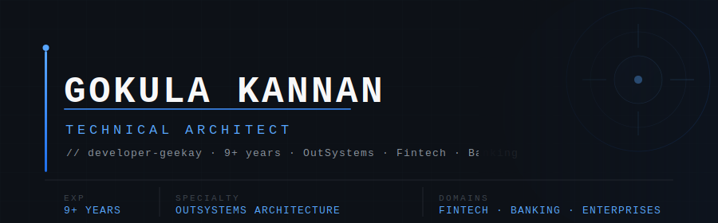

<div align="center">

</div>

<div align="center">

<br/>

[](https://gokulakannan.dev)

<br/>

[](https://gokulakannan.dev)
[](https://linkedin.com/in/developer-geekay)
[](mailto:developergeekay@gmail.com)
[](https://github.com/developer-geekay)

</div>

---

### `$ whoami`

```json
{
  "name"       : "Gokula Kannan",
  "alias"      : "developer-geekay",
  "role"       : "Technical Architect",
  "experience" : "9+ years",
  "domains"    : ["Fintech", "Banking", "Insurance", "Digital Transformation"],
  "speciality" : "OutSystems Architecture · Enterprise Integrations · Mobile Solutions",
  "website"    : "https://gokulakannan.dev",
  "motto"      : "Architect for scale. Build for humans."
}
```

> Technical Architect with **9+ years** designing and delivering enterprise-grade applications across **banking, financial services, insurance** and digital transformation initiatives.
> Specialized in **OutSystems architecture**, enterprise integrations, mobile solutions, and multi-stack development — with proven expertise in solution design, performance optimization, and technical leadership.

---

### 🛠️ Tech Stack

<details open>
<summary><b>🎨 Frontend</b></summary>
<br/>
<p>
  
  
  
  
  
  
</p>
</details>

<details open>
<summary><b>⚙️ Backend</b></summary>
<br/>
<p>
  
  
  
  
  
</p>
</details>

<details open>
<summary><b>🗄️ Data</b></summary>
<br/>
<p>
  
  
</p>
</details>

<details open>
<summary><b>🧩 Low-Code Platforms</b></summary>
<br/>
<p>
  
  
</p>
</details>

<details open>
<summary><b>🔧 DevOps & Infra</b></summary>
<br/>
<p>
  
  
  
  
  
</p>
</details>

---

### 🚀 Projects

<table>
  <tr>
    <td width="50%" valign="top">
      <h4><a href="https://github.com/Developer-Geekay/hostpanel">🖥️ hostpanel</a></h4>
      <p>Self-hosted server management panel with a modular package architecture. Packages cover Nginx, FTP, MySQL, MongoDB, Node.js, PHP, File Manager, and WireGuard VPN — each as an independent deployable module.</p>
      
      
      
    </td>
    <td width="50%" valign="top">
      <h4><a href="https://github.com/Developer-Geekay/outsystems-devtools">🔧 outsystems-devtools</a></h4>
      <p>Chrome extension for OutSystems developers — application inspection, network monitoring, and bulk title engine to supercharge the OutSystems development workflow.</p>
      
      
    </td>
  </tr>
  <tr>
    <td width="50%" valign="top">
      <h4><a href="https://github.com/Developer-Geekay/OutSystemsWidgetKit">🧩 OutSystemsWidgetKit</a></h4>
      <p>A widget toolkit for OutSystems — reusable, extensible UI components designed to plug into OutSystems low-code applications seamlessly.</p>
      
      
    </td>
    <td width="50%" valign="top">
      <h4><a href="https://github.com/Developer-Geekay/cordova-plugin-hyperpay">💳 cordova-plugin-hyperpay</a></h4>
      <p>Cordova plugin integrating the HyperPay payment gateway into hybrid mobile apps — enabling secure in-app payment flows for iOS and Android.</p>
      
      
    </td>
  </tr>
  <tr>
    <td width="50%" valign="top">
      <h4><a href="https://github.com/Developer-Geekay/cordova-plugin-regula">📖 cordova-plugin-regula</a></h4>
      <p>Cordova plugin for Regula document reader — enables identity document scanning and verification inside hybrid mobile applications.</p>
      
      
      
    </td>
    <td width="50%" valign="top">
      <h4><a href="https://github.com/Developer-Geekay/cordova-plugin-faceki">👤 cordova-plugin-faceki</a></h4>
      <p>Cordova plugin for Faceki — integrates AI-powered face recognition and liveness detection for KYC verification flows in hybrid mobile apps.</p>
      
      
    </td>
  </tr>
  <tr>
    <td width="50%" valign="top">
      <h4><a href="https://github.com/Developer-Geekay/google_auth_wasm">⚡ google_auth_wasm</a></h4>
      <p>Google Authenticator TOTP implementation compiled to WebAssembly using Rust — bringing native-speed 2FA generation directly into the browser.</p>
      
      
    </td>
    <td width="50%" valign="top">
      <h4><a href="https://github.com/Developer-Geekay/expense-app">💰 expense-app</a></h4>
      <p>A personal finance and expense tracking application — manage budgets, categorise spending, and visualise financial data with a clean TypeScript-based UI.</p>
      
    </td>
  </tr>
  <tr>
    <td width="50%" valign="top">
      <h4><a href="https://github.com/Developer-Geekay/yt-downloader">🎥 yt-downloader</a></h4>
      <p>A YouTube video downloader tool — fetch and save videos in multiple formats and resolutions via a simple JavaScript-based interface.</p>
      
      
    </td>
    <td width="50%" valign="top"></td>
  </tr>
</table>

---

### 📊 GitHub Stats

<div align="center">

<a href="https://github.com/developer-geekay">
  
  
</a>

<br/>


<br/>


</div>

---

### 🐍 Contribution Snake

<div align="center">
  
</div>

---

<div align="center">


</div>
